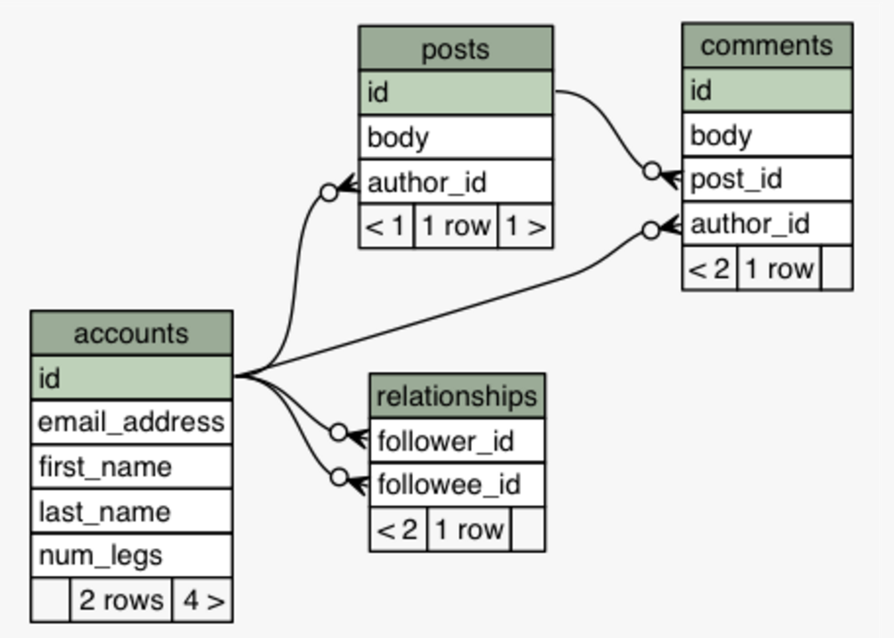

We'll set up the example API in [the demo](https://join-monster.herokuapp.com/graphql?query=%7B%20users%20%7B%20%0A%20%20id%2C%20fullName%2C%20email%0A%20%20posts%20%7B%20id%2C%20body%20%7D%0A%7D%7D). You can view the source code [here](https://github.com/stems/join-monster-demo/tree/master/schema-basic). If you would like to set this up from scratch, feel free the use the sample data provided for **SQLite3** at `/data/demo-data.sl3`.

## Defining SQL Schema

We'll set up a little API for a simple blog site for `Users` that can make `Posts` as well as `Comments` on people's posts. We will also let them follow other users. Here is a picture of the schema.



I'll omit the code to set up the SQL tables. You can find the implementation [here](https://github.com/stems/join-monster-demo/blob/master/data/schema.sql). Now let's take a look at the application layer.


## Declaring GraphQL Schema

Here is how the [graphql-js](https://github.com/graphql/graphql-js) schema would look.

```javascript
import { GraphQLSchema } from 'graphql'
import { GraphQLObjectType, GraphQLList, GraphQLString, GraphQLInt } from 'graphql'

const User = new GraphQLObjectType({
  name: 'User',
  fields: () => ({
    id: {
      type: GraphQLInt
    },
    email: {
      type: GraphQLString
    },
    idEncoded: {
      description: 'The ID base-64 encoded',
      type: GraphQLString,
      resolve: user => toBase64(user.idEncoded)
    },
    fullName: {
      description: 'A user\'s first and last name',
      type: GraphQLString
    }
  })
})

const QueryRoot = new GraphQLObjectType({
  name: 'Query',
  fields: () => ({
    users: {
      type: new GraphQLList(User),
      resolve: () => {} // TODO
    }
  })
})

export default new GraphQLSchema({
  description: 'a test schema',
  query: QueryRoot
})
```

This won't work yet. There are several things missing. Next, we'll map this object type to our `accounts` table in SQL.

