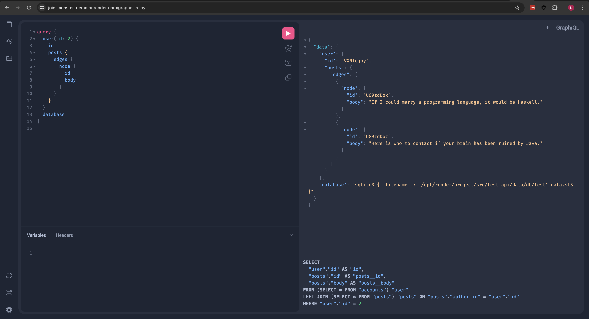

## Benefits

Using [Join Monster](https://github.com/join-monster/join-monster) provides the following benefits.

- **Batching** - Fetch all the data in a single database query. Cut down on network latency.
- **Efficient** - No over-fetching. Don't waste your server's memory.
- **Maintainability** - SQL is automatically generated and *adaptive*. No need to rewrite queries when the schema changes.
- **Unobtrusive** - Coexists with your custom resolve functions and existing schemas. Use it on the whole tree or only in parts. Retain the power and expressiveness in defining your schema.
- **Declarative** - Simply define the *data requirements* of the GraphQL fields on the SQL columns.
- **GraphQL becomes the ORM** - Mixing and matching sucks. With only a few additions of metadata, the GraphQL schema *becomes* the mapping relation.

It solved a real performance bottleneck due to network latency for us. We consider it a good prototyping tool because changing the schema is very easy to do. Only a few properties on the schema need to change in order to update the generated SQL. The developer is freed from the burden of manually translating queries to connect the two representations of the data — the GraphQL schema and the SQL schema.

## Limitations

There are some constraints on how your data model looks. We need to be able to make some assumptions in order to sensibly translate queries from a hierarchical structure to a relational one. Not all schemas will be able to allow [Join Monster](https://github.com/join-monster/join-monster) to handle all the data fetching, perhaps not in whole but in part.

It is not tested at high scale. Again, it is a prototyping tool at this point in time.  

Because you aren't writing the queries yourself, you lose some freedom to do some performance tuning. [Join Monster](https://github.com/join-monster/join-monster), however, remains transparent about what SQL it actually produces - an important capability for judiciously choosing database indexes. The developer is still responsible for making the generated queries optimized by creating the right indexes for better query plans. You can `console.log` the SQL queries or run your Node.js process with the environment variable `DEBUG=join-monster` for some useful diagnostic information. Furthermore, you can use our [custom version of GraphiQL](https://github.com/acarl005/graphsiql) used in [the demo](https://join-monster.herokuapp.com/graphql?query=%7B%20users%20%7B%20%0A%20%20id%2C%20fullName%2C%20email%0A%20%20posts%20%7B%20id%2C%20body%20%7D%0A%7D%7D) to visualize the SQL.

## Why Not Use Data Loader?

[DataLoader](https://github.com/facebook/dataloader) is Facebook's own solution for batch requests. It also caches individual entities. It's a simple and general tool for data fetching.

[Join Monster](https://github.com/join-monster/join-monster) is able to specialize for SQL, so you can avoid manually writing the queries (more configuring less programming). Data loader only batches requests for one resource, e.g. batching requests for users, or posts, etc. Join Monster can batch **everything** into one trip.

DataLoader derives its performance benefit from caching. Caching opens a can of worms. You have to think about cache invalidation, memory pressure, loading the cache, etc. For us, the batching was such a win that our performance issues were solved. The cache is complexity that we didn't need. This means less developer labor and cognitive burden.

